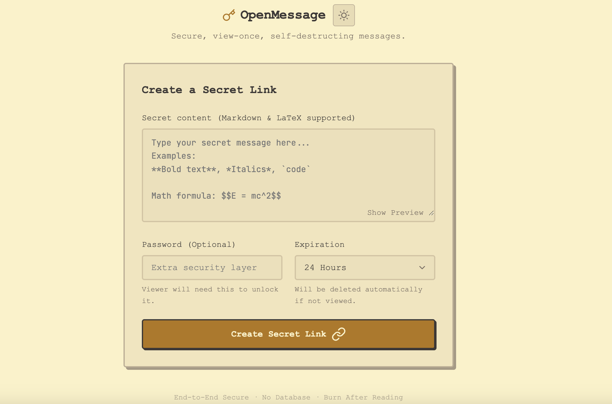
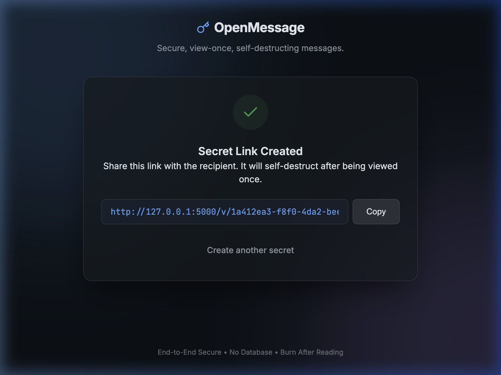
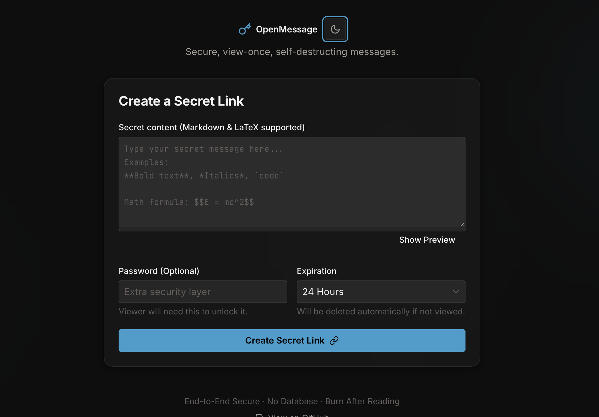

# OpenMessage

OpenMessage is a secure, view-once, self-destructing message application built with Python and Flask. Its core philosophy is "Burn After Reading" — messages are destroyed from the server immediately upon being read, leaving no trace behind. No database required; messages are stored as encrypted local JSON files.

## Features

- **End-to-End Encryption**: AES-128-CBC + HMAC-SHA256 (Fernet). The encryption key is returned to the client and never stored alongside the ciphertext.
- **View-Once Guarantee**: The moment a message is viewed, it is permanently deleted from the server.
- **No Database Needed**: Simplified architecture using local JSON file storage.
- **Optional Password Protection**: Add a secondary layer of security to your messages.
- **Expiration Logic**: Messages automatically self-destruct if not viewed within the configured time (1 hour, 24 hours, or 7 days).
- **Rich Text Support**: Full rendering of Markdown and LaTeX (via KaTeX).
- **Dark Mode**: Notion-inspired glassmorphism design with automatic system theme detection and manual toggle.
- **Safe Previews**: Link preview crawlers (Slack, Discord, iMessage) will not accidentally burn the message. Viewing requires an explicit user action.
- **Interactive Envelope**: CSS-animated paper envelope with a red wax seal to "open" your secret.
- **Security Hardened**: UUID path validation, CSP headers, no-store cache policy, `X-Content-Type-Options`, `X-Frame-Options`, `expires_in` whitelist, rate limiting, atomic one-time read.
- **Accessible**: Keyboard-navigable envelope (Tab + Enter), password Enter-to-submit, secure context clipboard fallback.

## Screenshots

| Light Mode | Dark Mode |
| --- | --- |
|  |  |

*Create a secret message*

| Light Mode | Dark Mode |
| --- | --- |
|  |  |

*Share the one-time link*

## Tech Stack

- **Backend**: Python 3, Flask, Werkzeug
- **Cryptography**: `cryptography` library (Fernet — AES-128-CBC + HMAC-SHA256)
- **Frontend**: HTML5, Vanilla CSS3 (Glassmorphism Design System), Vanilla JavaScript
- **Markdown & Math**: Marked.js, KaTeX, DOMPurify

## Getting Started

### Prerequisites

Ensure you have Python 3.7+ installed.

### Installation & Running

1. Clone this repository:
   ```bash
   git clone <your-repo-url>
   cd openMessage
   ```

2. Create a virtual environment and install dependencies:
   ```bash
   python3 -m venv venv
   source venv/bin/activate
   pip install -r requirements.txt
   ```

3. Run the application:
   ```bash
   # Development mode
   python app.py

   # Production mode (using gunicorn)
   gunicorn --bind 127.0.0.1:5000 --workers 2 --threads 4 --timeout 30 app:app
   ```

4. Access the app in your browser at `http://localhost:5000`.

### Environment Variables

| Variable | Description | Default |
| --- | --- | --- |
| `SECRET_KEY` | Flask secret key for sessions | Auto-generated random value |
| `RATE_LIMIT_STORAGE_URI` | Flask-Limiter storage backend (set Redis in production) | `memory://` |
| `OPENMESSAGE_V2_E2E` | Enable browser-side v2 WebCrypto create/read flow (`0`, `false`, `no`, `off` disable it) | `1` |

### Production Gunicorn Settings

Use Gunicorn as the WSGI process manager and keep Flask as the application runtime. A practical starting point for a small OpenMessage deployment is:

```bash
gunicorn \
  --bind 127.0.0.1:5000 \
  --workers 2 \
  --threads 4 \
  --worker-class gthread \
  --timeout 30 \
  --graceful-timeout 30 \
  --keep-alive 2 \
  --max-requests 1000 \
  --max-requests-jitter 100 \
  app:app
```

Tune from that baseline instead of migrating frameworks first:

- Start with `workers = CPU cores` or `CPU cores * 2` for small hosts, then raise only when CPU is not saturated.
- Keep `threads` between `2` and `8`; this app has short request handlers with local file I/O, so moderate threads improve concurrency without excessive process count.
- Keep `timeout` and `graceful-timeout` around `30s`; normal create/view requests should complete far faster, so longer values usually hide stuck workers.
- Set `RATE_LIMIT_STORAGE_URI` to Redis or another shared backend in production. The default `memory://` limiter is per-process and does not coordinate across Gunicorn workers.
- Place `data/` on local persistent storage. Avoid slow network filesystems unless storage baseline p95 is re-measured there.

Measure storage before and after deployment changes:

```bash
./venv/bin/python scripts/storage_baseline.py --count 1000 --payload-bytes 1024
```

## How It Works

1. **Creation**: User inputs a message. With v2 enabled, the browser creates an AES-GCM key and encrypts locally with WebCrypto before any network request. If v2 is disabled or WebCrypto is unavailable, the legacy v1 server-side Fernet flow is used.
2. **Storage**: v2 stores only an opaque ciphertext package, expiry metadata, and an optional password hash in `data/<uuid>.json`. The server does not receive plaintext or the WebCrypto key. v1 stores Fernet ciphertext and keeps its existing behavior.
3. **Sharing**: A unique URL is generated containing the ID and client-held decryption material in the URL hash fragment (`http://site.com/v/<id>#v2.<key>` for v2, `#<key>` for v1). Hash fragments are not sent during normal HTTP GET navigation.
4. **Viewing**: The recipient opens the URL. An animated envelope confirmation page appears. Upon opening the envelope, v2 retrieves the opaque ciphertext package from `/api/v2/message/<id>`, deletes it server-side, and decrypts locally in the browser. v1 keeps the previous server-decrypt API for compatibility.

### v1/v2 Compatibility and Migration

- Existing v1 links and stored messages continue to work through `/api/message` and `/api/message/<id>`.
- New browsers with WebCrypto support use the v2 flow by default while `OPENMESSAGE_V2_E2E` is enabled.
- Disable v2 with `OPENMESSAGE_V2_E2E=0` to force new messages back to the v1 API without changing existing data.
- The `/v/<id>` confirmation page is shared by both versions because it reads only safe metadata.
- Password protection remains server-side access control in v2: the password gates one-time retrieval of the opaque ciphertext package, but encryption and decryption stay local to the browser.
- v2 payload validation checks only the ciphertext package format (`version`, `alg`, `iv`, `ciphertext`) and never inspects plaintext.

### Temporary Retry Semantics

During password-protected reads, OpenMessage may briefly hold a message file while it verifies the supplied password. If another read request reaches the same message in that short window, the API returns HTTP `409` with `{"error": "Secret is temporarily locked", "retryable": true}` instead of treating the message as missing. This state is transient: clients should wait briefly and retry once, while non-retryable errors such as `401`, `404`, or `400` should keep their normal handling. The built-in frontend already performs one short retry for this response.

## Security

- **Path traversal protection**: All message IDs are validated as UUID v4; `realpath` check prevents directory traversal.
- **Atomic verification**: Password check and message deletion happen in a single operation — wrong password does not destroy the message.
- **CSP headers**: Content-Security-Policy restricts script/style/font sources.
- **Rate limiting**: Message creation and view endpoints are throttled (global + per-message) to reduce abuse and brute force attempts.
- **No key storage**: The decryption key never touches the server disk; it lives only in the URL hash fragment (never sent to the server in a GET request).
- **v2 opaque storage**: In the WebCrypto v2 flow, the server stores only an opaque AES-GCM ciphertext package and cannot decrypt message content.
- **Expiration enforcement**: Expired messages are cleaned up automatically on creation and rejected on access.

## License

This project is licensed under the [MIT License](LICENSE).
