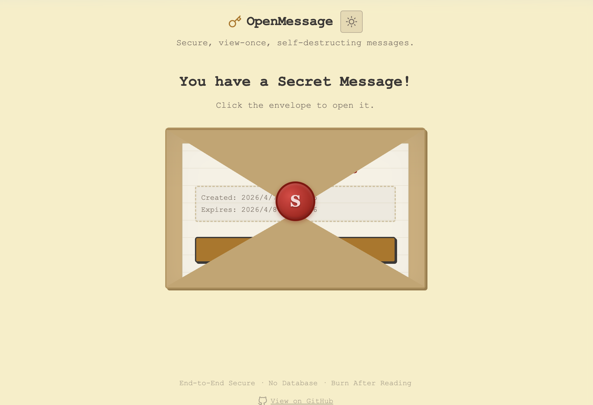
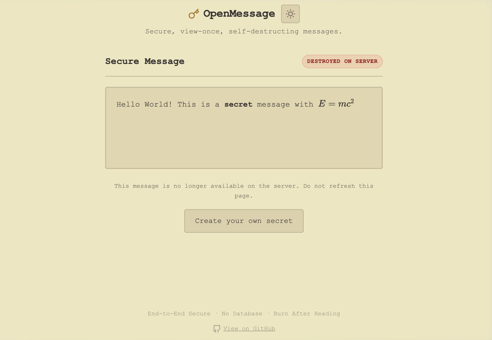

# OpenMessage

OpenMessage is a secure, view-once, self-destructing message application built with Python and Flask. Its core philosophy is "Burn After Reading" - messages are destroyed from the server immediately upon being read, leaving no trace behind. It does not use a database; instead, messages are stored as encrypted local JSON files.

## Features

- **End-to-End Security Philosophy**: The server generates an AES-256 (GCM) key when a message is created. The key is returned to the client and never stored alongside the ciphertext. 
- **View-Once Guarantee**: The moment a message is viewed, it is permanently deleted from the server.
- **No Database Needed**: Simplified architecture using local JSON storage.
- **Optional Password Protection**: Add a secondary layer of security to your messages.
- **Expiration Logic**: Messages automatically self-destruct if not viewed within the configured time (1 hour, 24 hours, or 7 days).
- **Rich Text Support**: Full support for rendering Markdown and LaTeX (via KaTeX).
- **Retro UI**: A warm, terminal-inspired retro aesthetic with Gruvbox colors.
- **Safe Previews**: Link preview crawlers (like Slack, Discord, or iMessage) will not accidentally burn the message. Viewing requires an explicit user action.
- **Interactive Envelope**: A satisfying CSS-animated paper envelope and red wax seal to "open" your secret.

## Screenshots

| Homepage | Created Success |
| --- | --- |
|  |  |

| Viewing Confirmation | Decrypted Message |
| --- | --- |
|  |  |

## Tech Stack

- **Backend**: Python 3, Flask, Werkzeug
- **Cryptography**: `cryptography` library (AES-128-CBC / HMAC-SHA256 via Fernet)
- **Frontend**: HTML5, Vanilla CSS3 (Custom Dark Mode Design), Vanilla JavaScript
- **Markdown & Math**: Marked.js, KaTeX, DOMPurify

## Getting Started

### Prerequisites

Ensure you have Python 3.7+ installed.

### Installation & Running

1. Clone this repository:
   ```bash
   git clone <your-repo-url>
   cd openMessage
   ```

2. Create a virtual environment and install dependencies:
   ```bash
   python3 -m venv venv
   source venv/bin/activate
   pip install -r requirements.txt
   ```

3. Run the application:
   ```bash
   # Development mode
   python app.py
   
   # Production mode (using gunicorn)
   gunicorn --bind 127.0.0.1:5000 app:app
   ```

4. Access the app in your browser at `http://localhost:5000`.

## How It Works

1. **Creation**: User inputs a message. The server creates a random AES encryption key. This key is used to encrypt the message, and then the server returns the key to the client's browser without saving it.
2. **Storage**: The application stores only the ciphertext, an expiry timestamp, and an optional password hash in `data/<uuid>.json`.
3. **Sharing**: A unique URL is generated containing the ID and the decryption key in the URL hash fragment (`http://site.com/v/<id>#<key>`).
4. **Viewing**: The recipient opens the URL. A confirmation page appears. Upon clicking "View Secret", the browser sends the key back to the server. The server reads the file, **immediately deletes it** from the filesystem, decrypts the content, and returns the plain text to be rendered securely on the frontend.

## License

This project is licensed under the [MIT License](LICENSE).
